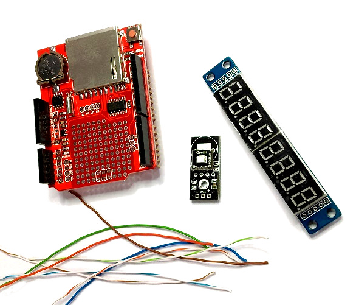
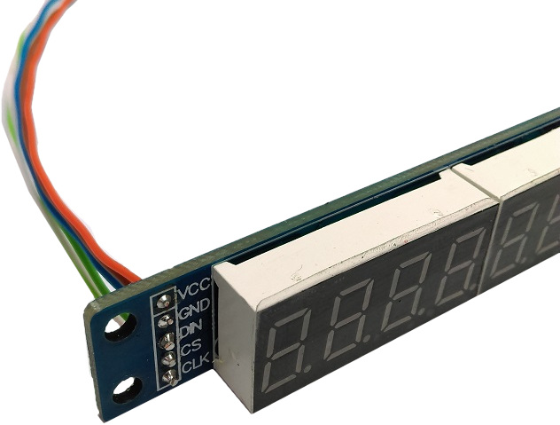
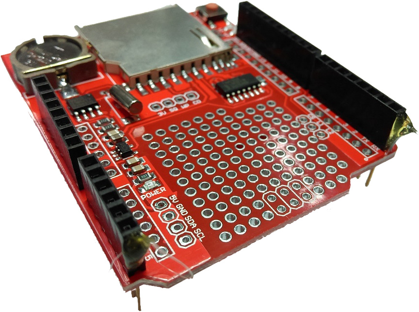
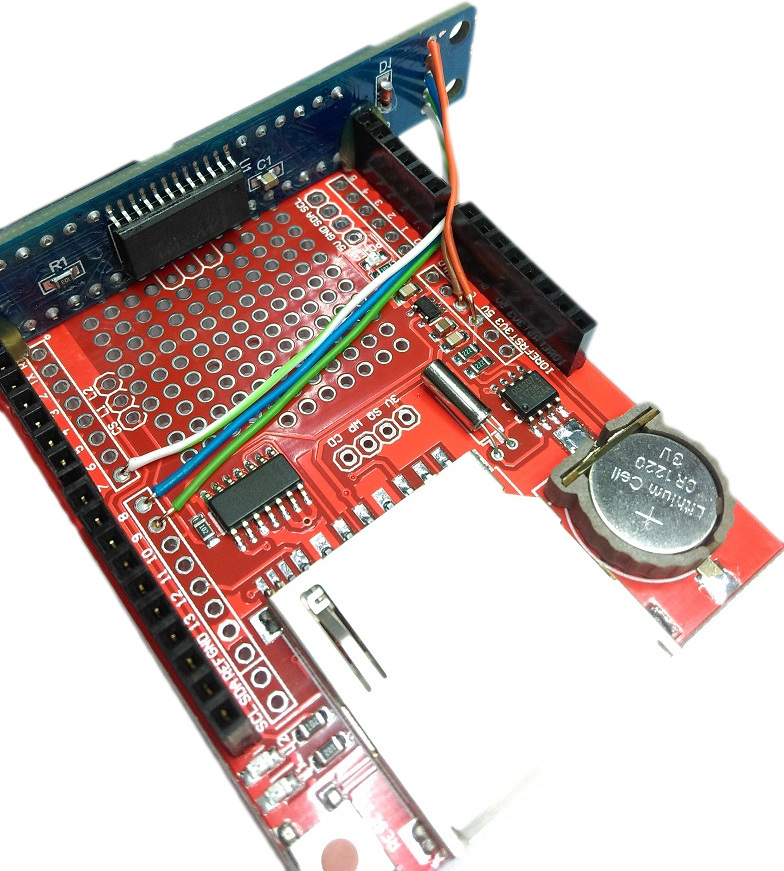
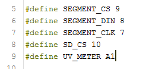
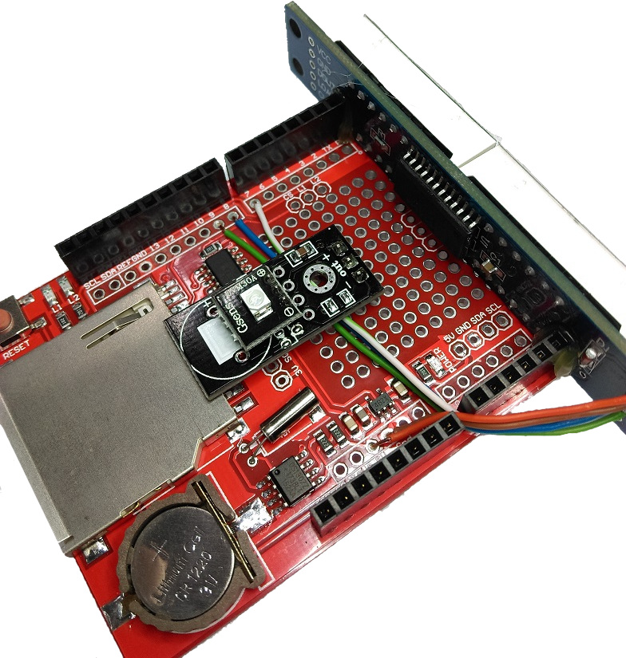
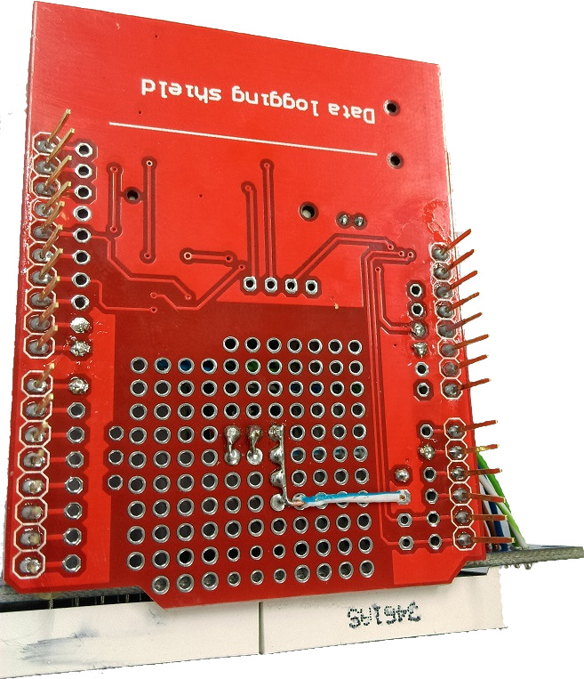

# UV Meter

This simple yet effective project will provide a way to the UV levels in your area, which is helpful to determine what level of sun protection is needed on a particular day. Readings can be displayed on the 7 segment display and are stored on the SD card for easy tracking.									

## Bill of materials
|Qty | Code | Description |
| --- | --- | --- |
|1 | [XC4410](http://jaycar.com.au/p/XC4410) | Arduino Uno |
|1 | [XC4536](http://jaycar.com.au/p/XC4536) | Datalogging shield |
|1 | [XC3714](http://jaycar.com.au/p/XC3714) | 7 Segment Display Module |
|1 | [WB2022](http://jaycar.com.au/p/WB2022) | Cat5 solid core cable |
|1 | [XC4518](http://jaycar.com.au/p/XC4518) | UV sensor module |

## Software Libraries
| Library | Author  | Version |
| --- | --- | --- |
| RTCLib | Adafruit | 1.2.0 |
| SdFat | Bill Greiman | 1.0.7 |

## Connection table
| 7Segment Module | UNO | UV | Description |
| --- | ---- | ----| --- |
| DIN | 8 | | Data to module |
| CS | 9 |  | Chip select |
| CLK | 7 | | Clock signal |
| | A1 | out | Sensor output |
|VCC | 5V | + | Positive Rail |
| GND | GND | - | Ground |

###### Notes:
* Do not connect UV Meter to `A4` or `A5`, as these are needed to talk to the RTC.
* DIN/CS/CLK has had trouble connecting to the HW SPI on pins 13,12,11. Bit-bang on 9,8,7 is fine for our purposes.

## Assembly instructions

#### Remove Headers
Start by removing all the header pins from the UV Module and the 7 Segment display module. If you haven't done it before, we have a helpful guide [here](https://github.com/Jaycar-Electronics/databook/blob/master/tutorial/Removing%20Headers.md).

Also cut about 10cm of CAT5 cable, and separate the colour coded wires. You can slide them over the corner of a counter to straighten them out, as they will be in twisted pairs and it will be easier to work with if they are straight.

#### Connect 7SEG module
Strip the end of the copper wires and connect them to the display module. Solder them on (Being sure to use the side that has `DIN` on it) and trim them with side cutters so they look neat on the module.

###### Glue in place
Use a hot glue gun to place a small amount of glue on both ends of the header rows on the prototyping shield, furthest away from the SD card slot:

then press the display in place, being sure to clear the solder joints (as shown below)

###### Solder connections

Solder copper wires to where they must go. The top two connections on the display `VCC` and `GND` should connect to `5V` and `GND` respectively.
The other 3 wires can go for 7,8 & 9. In whatever order you want, as you can change it in code later too.

Be careful not to use pin 10, as this is the `Chip Select` pin for the SD Card, needed for when we control the SD card later.

#### UV Module

The [XC3714](http://jaycar.com.au/p/XC3714) module comes with a spare 5 pin header, you can snip this with some side-cutters to make it into a 3 pin header and solder this onto the UV Meter, so that you can mount it upwards on the board ( as below.)

Position the UV meter on the prototyping shield, making sure that none of the contacts on the UV Module are touching the metal SD-card case. You can see on our picture above, that the two solder pads that are in the big circle mark are not touching the SD case. Doing so would cause a short and can potentially ruin the sensor or Arduino. Doing it this way also bridges over the wires nicely.

Connect the `+` `-` to `5v` and `GND` and the `out` signal over to `A1`. You can use any Analogue sensor except for `A4` and `A5` for this, as those two are used to talk to the RTC.

Here I used wire on the top side of the board for the nearby 5V and A1, with the Ground signal using the bottom side to go across to Ground.

## Programming
No special programming, but the RTC will auto-initialise to your compiled at time at time of programming if it's not already running.

## Use
When you power on the device and leave it in the sun, the digits on the display will show. The 4 digits on the left hand side of the display is the UV reading, and the right hand side is the time (24 hour format) 
for instance, `0034.08.08.` will be the UV reading of 34, at 8 past 8 in the morning.
When you insert an SD card, you must reset the unit, and it will mount the SD card and begin writing log files until the SD card is full.

SD logging is in the form of 
`20181225 15:15:05,32`
which will correspond to a reading of 32 at 3:15 pm on the 25th of December, 2018 (YYYYMMDD HH:MM:SS, UV)

## Future Improvements

* You could add a temperature sensor [XC4494](https://jaycar.com.au/p/XC4494) to show a more complete readout of the outside setting.
