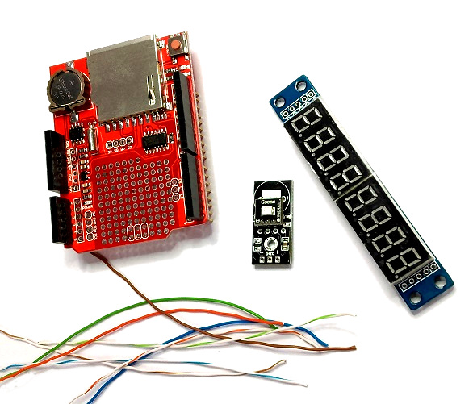
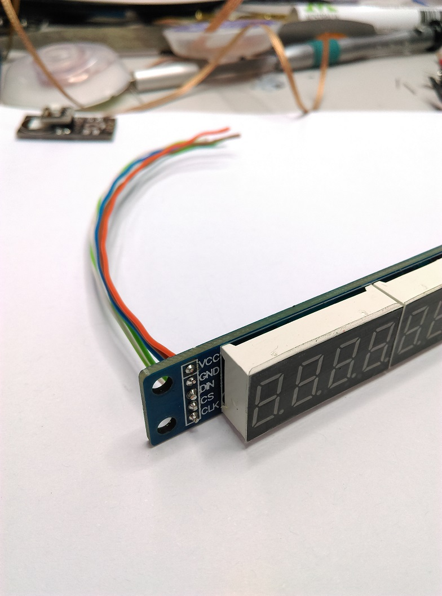
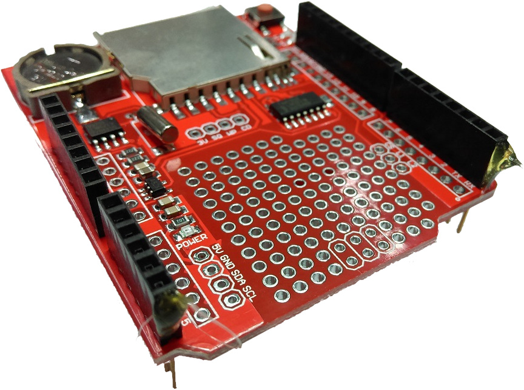
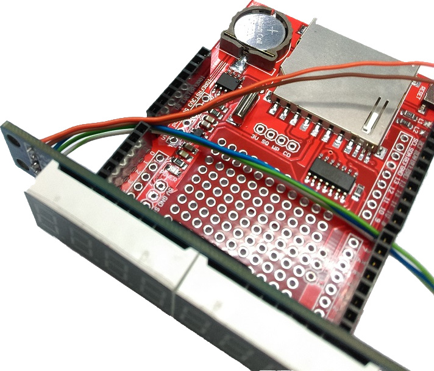
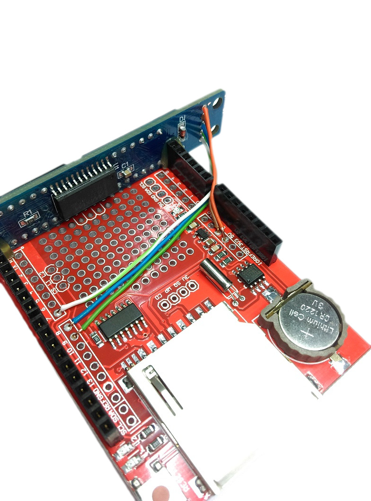
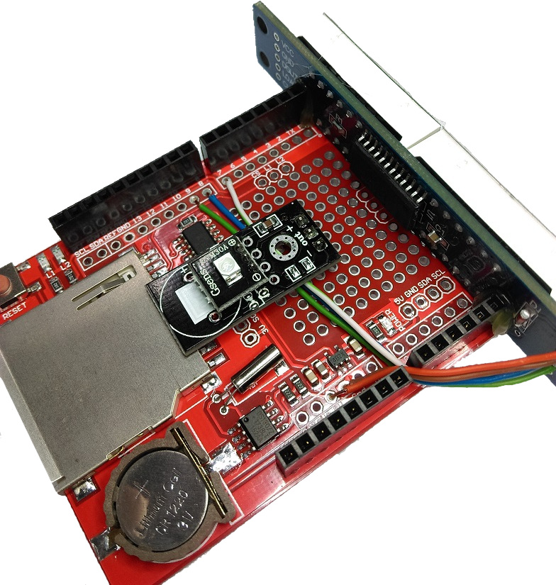
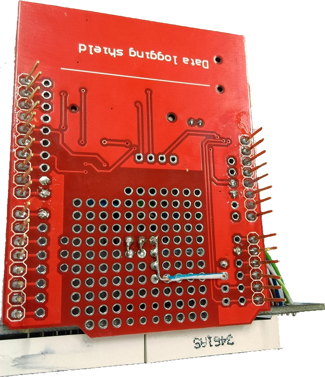

# UV Meter

This simple yet effective project will provide a way to the UV levels in your area, which is helpful to determine what level of sun protection is needed on a particular day. Readings can be displayed on the 7 segment display and are stored on the SD card for easy tracking.									

## Bill of materials
|Qty | Code | Description |
| --- | --- | --- |
|1 | [XC4410](http://jaycar.com.au/p/XC4410) | Arduino Uno |
|1 | [XC4536](http://jaycar.com.au/p/XC4536) | Datalogging shield |
|1 | [XC3714](http://jaycar.com.au/p/XC3714) | 7 Segment Display Module |
|1 | [WB2022](http://jaycar.com.au/p/WB2022) | Cat5 solid core cable |
|1 | [XC4518](http://jaycar.com.au/p/XC4518) | UV sensor module |

## Software Libraries
| Library | Author  | Version |
| --- | --- | --- |
| RTCLib | Adafruit | 1.2.0 |
| SdFat | Bill Greiman | 1.0.7 |

## Connection table
| 7Segment Module | UNO | UV | Description |
| --- | ---- | ----| --- |
| DIN | 8 | | Data to module |
| CS | 9 |  | Chip select |
| CLK | 7 | | Clock signal |
| | A1 | out | Sensor output |
|VCC | 5V | + | Positive Rail |
| GND | GND | - | Ground |

###### Notes:
* Do not connect UV Meter to `A4` or `A5`, as these are needed to talk to the RTC.
* DIN/CS/CLK has had trouble connecting to the HW SPI on pins 13,12,11. Bit-bang on 9,8,7 is fine for our purposes.

## Assembly instructions

# 1.
Start by removing all header pins from the modules. If you have not removed pins from circuit boards before, we have a helpful guide located  [here](https://github.com/Jaycar-Electronics/databook/blob/master/tutorial/Removing%20Headers.md).

# 2.
Solder 5 pieces of solid core wire to the rear of the LCD display output. The colours don't need to match ours, however using different colours will assist in wiring the board later.

# 3.
Place a small amount of hot glue onto the end of the board opposite to the SD card slot, and mount the LCD display as shown below.

# 4.
Matching the colours from step 2 or by using the connection table, solder the wires in place onto the board.

# 5.
Solder a header onto the UV meter. While the XC3714 module has 5 header pins, we only need 3 for use with this project.

# 6.
Mount the UV sensor on the board, ensuring the wires from the LCD are routed underneath.

# 7.
Finally, you will need to link the contacts for A5, +5V & GND. While you can do this using wire, we have found the pictured method was ideal for the simplistic nature of the kit.

